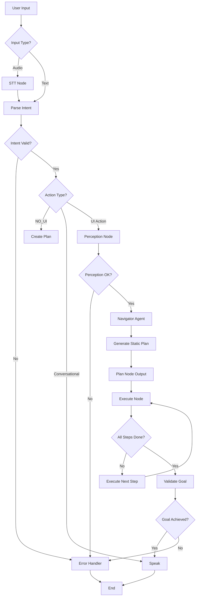

# AURA Agent Architecture - How Agents Work, Plan, and Replan

**Date:** February 2, 2026  
**Status:** Current implementation analysis + recommendations

---

## Table of Contents

1. [Executive Summary](#executive-summary)
2. [Two Agent Architectures](#two-agent-architectures)
3. [Current Flow: Navigator Agent (Legacy)](#current-flow-navigator-agent-legacy)
4. [New Flow: Universal Agent (ReAct Pattern)](#new-flow-universal-agent-react-pattern)
5. [Perception System](#perception-system)
6. [Planning & Replanning Logic](#planning--replanning-logic)
7. [Decision Trees & Routing](#decision-trees--routing)
8. [Critical Issues & Recommendations](#critical-issues--recommendations)

---

## Executive Summary

AURA has **two parallel agent architectures**:

| Aspect | **Navigator (Current Default)** | **UniversalAgent (New)** |
|--------|--------------------------------|--------------------------|
| **Status** | ✅ Default (Deprecated) | 🚧 Available but not default |
| **Planning** | Static, upfront LLM call | Dynamic ReAct loop |
| **Perception** | One-time before planning | Continuous after each action |
| **VLM Usage** | Fallback only (threshold < 0.6) | Integrated in perception loop |
| **Replanning** | ❌ No replanning | ✅ Dynamic replanning |
| **Config Flag** | (default) | `USE_UNIVERSAL_AGENT=true` |

**Key Finding:** Your Amazon cart example failed because Navigator:
1. Plans all steps upfront without seeing intermediate screens
2. Uses VLM only as fallback when text matching fails
3. Cannot replan when expectations don't match reality

---

## Two Agent Architectures

### Architecture 1: Navigator (Legacy) - Static Planning

```
┌─────────────────────────────────────────────────────────────────┐
│                     NAVIGATOR FLOW (DEFAULT)                    │
└─────────────────────────────────────────────────────────────────┘

Input → STT → Parse Intent → Perception (ONE TIME) → Navigator → Executor → Done
                                    ↓                     ↓
                              [UI Tree +            [Static Plan]
                               Screenshot]          6 steps generated
                                                    NO observation
                                                    NO replanning
```

**Code Location:** `agents/navigator.py`

#### How Navigator Works:

```python
def create_execution_plan(intent, perception_bundle):
    """Create plan from intent - SINGLE LLM CALL"""
    
    # 1. Get UI elements from bundle (ONE TIME)
    elements = perception_bundle.ui_tree.elements
    
    # 2. Match target to UI elements (text search)
    match = find_element(elements, intent.target)
    
    # 3. Use VLM ONLY if text match fails
    if not match or match.score < 0.6:  # Fallback threshold
        vlm_match = _smart_visual_locate(bundle, target)
    
    # 4. Return complete plan - NO REPLANNING
    return [
        {"step": 1, "action": "tap", "x": x, "y": y},
        {"step": 2, "action": "type", "text": "..."},
        # ... all steps predetermined
    ]
```

**Problems:**
- ❌ Plans without seeing intermediate screens
- ❌ Assumes linear flow (Step 1→2→3→4)
- ❌ VLM only used when text search fails
- ❌ Cannot adapt when UI differs from expectations

---

### Architecture 2: UniversalAgent - ReAct Pattern

```
┌─────────────────────────────────────────────────────────────────┐
│                  UNIVERSAL AGENT FLOW (NEW)                      │
└─────────────────────────────────────────────────────────────────┘

                    ╔════════════════════════╗
                    ║   ReAct Loop (Goal)    ║
                    ╚════════════════════════╝
                              │
                    ┌─────────▼──────────┐
                    │  1. OBSERVE        │
                    │  Get Perception    │◄────┐
                    │  (UI + Screenshot) │     │
                    └─────────┬──────────┘     │
                              │                │
                    ┌─────────▼──────────┐     │
                    │  2. THINK          │     │
                    │  Reason Next Action│     │
                    │  (LLM Call)        │     │
                    └─────────┬──────────┘     │
                              │                │
                    ┌─────────▼──────────┐     │
                    │  3. ACT            │     │
                    │  Execute Action    │     │
                    └─────────┬──────────┘     │
                              │                │
                    ┌─────────▼──────────┐     │
                    │  4. WAIT           │     │
                    │  Let UI Settle     │     │
                    └─────────┬──────────┘     │
                              │                │
                    ┌─────────▼──────────┐     │
                    │  5. VERIFY         │     │
                    │  Check Success     │     │
                    └─────────┬──────────┘     │
                              │                │
                         Goal Done? ───No──────┘
                              │
                             Yes
                              │
                            Done
```

**Code Location:** `agents/universal_agent.py`

#### How UniversalAgent Works:

```python
async def _execute_subgoal(self, subgoal, goal):
    """ReAct loop - OBSERVE after each action"""
    
    while not goal.completed:
        # 1. OBSERVE: Get fresh perception
        self.current_bundle = await self._get_perception()
        
        # 2. CHECK: Is subgoal already done?
        if self._is_subgoal_already_complete(subgoal, self.current_bundle):
            return True
        
        # 3. THINK: Reason about next action (LLM call)
        reasoned = self.reasoning.reason_next_action(
            goal=goal,
            perception_bundle=self.current_bundle,
            last_action_result=last_result,
        )
        
        # 4. ACT: Execute action
        result = await self._execute_action(reasoned)
        
        # 5. WAIT: Let UI stabilize
        await asyncio.sleep(0.8)
        
        # 6. VERIFY: Check outcome
        after_bundle = await self._get_perception()
        verification = self.reasoning.verify_action_success(
            action=reasoned,
            before_bundle=before_bundle,
            after_bundle=after_bundle,
        )
        
        # 7. REPLAN if failed
        if not verification["success"]:
            # Analyze failure intelligently
            failure_report = self.failure_analyzer.analyze_failure(
                action=reasoned,
                before_bundle=before_bundle,
                after_bundle=after_bundle,
            )
            
            # Get recovery plan
            strategy = self.recovery_strategist.get_recovery_plan(
                failure=failure_report,
                original_action=reasoned,
            )
            
            # Attempt recovery
            recovered = await self._attempt_recovery(strategy)
```

**Advantages:**
- ✅ Observes screen after each action
- ✅ Adapts plan based on current state
- ✅ Uses VLM in perception loop
- ✅ Can replan when stuck

---

## Current Flow: Navigator Agent (Legacy)

### Full Execution Pipeline



### Navigator Planning Logic

**File:** `agents/navigator.py:86-180`

```python
def create_execution_plan(self, intent, perception_bundle):
    """
    SINGLE LLM CALL - Creates entire plan upfront
    """
    action = intent.action.lower()
    
    # Route to specific plan creator based on action type
    if action in ["tap", "click"]:
        plan = self._create_tap_plan(intent, perception_bundle)
    elif action in ["type", "input"]:
        plan = self._create_type_plan(intent, perception_bundle)
    elif action == "play" and intent.content:
        plan = self._create_play_content_plan(intent, perception_bundle)
    else:
        plan = self._create_generic_plan(intent, perception_bundle)
    
    return plan  # Static plan - no replanning
```

### Element Matching Strategy

**Priority Order:**
1. **UI Tree Text Match** (primary)
   ```python
   # agents/navigator.py:280-295
   elements = bundle.ui_tree.elements
   match = find_element(elements, target)
   
   # Score based on fuzzy text matching
   if match.score < 0.6:  # Weak match threshold
       # Escalate to VLM
       vlm_match = _smart_visual_locate(bundle, target)
   ```

2. **VLM Fallback** (threshold < 0.6 only)
   ```python
   # agents/navigator.py:640-680
   def _smart_visual_locate(self, bundle, target, action=None):
       """Use VLM ONLY when text matching fails"""
       if not bundle.screenshot:
           return None
       
       prompt = get_element_prompt(target, width, height)
       result = self.vlm_service.analyze_image(screenshot, prompt)
       # Returns coordinates if found
   ```

**Problem:** In Amazon example, text match found "iPhone 17 Pro" in search **suggestions**, not search **results**. VLM was never called because text match confidence was high (button with exact text).

---

## New Flow: Universal Agent (ReAct Pattern)

### Goal Decomposition

**File:** `services/goal_decomposer.py`

```python
class GoalDecomposer:
    """Breaks user request into subgoals using LLM"""
    
    def decompose(self, utterance, current_screen):
        """
        LLM Call: Break utterance into steps
        
        Input: "add iPhone 17 Pro to my cart in Amazon"
        
        Output:
        [
            Subgoal("Open Amazon app", action_type="open_app"),
            Subgoal("Search for iPhone 17 Pro", action_type="tap"),
            Subgoal("Type iPhone 17 Pro", action_type="type"),
            Subgoal("Select product from results", action_type="tap"),
            Subgoal("Add to cart", action_type="tap"),
        ]
        """
        prompt = get_planning_prompt(utterance, screen_context)
        result = self.llm_service.run(prompt)
        return self._parse_subgoals(result)
```

### ReAct Loop with Replanning

**File:** `agents/universal_agent.py:337-550`

```python
async def _execute_subgoal(self, subgoal, goal):
    """
    Execute single subgoal with continuous observation
    """
    actions_taken = 0
    
    while actions_taken < MAX_ACTIONS_PER_SUBGOAL:
        # ═══════════════════════════════════════
        # STEP 1: OBSERVE
        # ═══════════════════════════════════════
        logger.debug("👁️ Observing screen state...")
        self.current_bundle = await self._get_perception()
        
        # Log what we see
        if self.current_bundle.ui_tree:
            pkg = self._get_package_from_bundle(bundle)
            logger.info(f"📱 Current: app={pkg}, elements={len(bundle.ui_tree.elements)}")
        
        # ═══════════════════════════════════════
        # CRITICAL: Check if goal already achieved
        # ═══════════════════════════════════════
        goal_check = self.reasoning.verify_goal_completed(goal, self.current_bundle)
        if goal_check.get("completed"):
            logger.info(f"🎯 GOAL ACHIEVED: {goal_check.get('reason')}")
            goal.completed = True
            return True
        
        # ═══════════════════════════════════════
        # STEP 2: THINK
        # ═══════════════════════════════════════
        logger.debug("🧠 Reasoning about next action...")
        reasoned = self.reasoning.reason_next_action(
            goal=goal,
            perception_bundle=self.current_bundle,
            last_action_result=last_result,
        )
        
        # Check if reasoning says we're done/stuck
        if reasoned.action_type == ActionType.DONE:
            return True
        if reasoned.action_type == ActionType.STUCK:
            return False
        
        # ═══════════════════════════════════════
        # STEP 3: ACT
        # ═══════════════════════════════════════
        logger.info(f"⚡ Executing {reasoned.action_type.value}")
        result = await self._execute_action(reasoned)
        
        # ═══════════════════════════════════════
        # STEP 4: WAIT
        # ═══════════════════════════════════════
        delay = self.action_delays.get(action_name, 0.8)
        await asyncio.sleep(delay)
        
        # ═══════════════════════════════════════
        # STEP 5: VERIFY (Observe again)
        # ═══════════════════════════════════════
        after_bundle = await self._get_perception()
        verification = self.reasoning.verify_action_success(
            action=reasoned,
            before_bundle=before_bundle,
            after_bundle=after_bundle,
        )
        
        # ═══════════════════════════════════════
        # STEP 6: REPLAN if needed
        # ═══════════════════════════════════════
        if not verification["success"]:
            # Intelligent failure analysis
            failure_report = self.failure_analyzer.analyze_failure(
                action=reasoned,
                before_bundle=before_bundle,
                after_bundle=after_bundle,
            )
            
            # Get recovery strategy
            strategy = self.recovery_strategist.get_recovery_plan(
                failure=failure_report,
                original_action=reasoned,
            )
            
            # Attempt recovery
            recovered = await self._attempt_recovery(strategy)
            if not recovered:
                # Escalate retry strategy
                old_strategy = subgoal.escalate_strategy()
                if old_strategy == RetryStrategy.ABORT:
                    return False
        
        actions_taken += 1
    
    return False  # Exceeded max actions
```

### Reasoning Engine

**File:** `services/reasoning_engine.py:209-450`

```python
class ReasoningEngine:
    """
    LLM-powered reasoning for action selection
    """
    
    def reason_next_action(self, goal, perception_bundle, last_result):
        """
        CORE INTELLIGENCE: Decide next action based on current screen
        
        Returns: ReasonedAction with type, target, coordinates, reasoning
        """
        # Build minimal observation string
        observation = self._build_observation(perception_bundle, last_result)
        
        # Build context with goal progress
        context = self._build_context(goal)
        
        # Check for loops
        loop_analysis = self.loop_detector.detect()
        if loop_analysis.is_looping:
            loop_warning = build_loop_warning(
                loop_type=loop_analysis.loop_type,
                repeated_action=loop_analysis.repeated_action,
                loop_count=loop_analysis.loop_count,
                suggestion=loop_analysis.suggestion,
            )
        
        # Build reasoning prompt
        prompt = get_reasoning_prompt(
            goal=goal.description,
            current_step=goal.current_subgoal.description,
            observation=observation,
            action_history=self._summarize_history(),
            loop_warning=loop_warning if loop_analysis.is_looping else None,
        )
        
        # LLM Call
        result = self.llm_service.run(prompt, max_tokens=800)
        
        # Parse response (JSON with action + reasoning)
        parsed = self._parse_action_response(result)
        
        # Convert to ReasonedAction
        return ReasonedAction(
            action_type=ActionType[parsed["action"]],
            target=parsed.get("target"),
            reasoning=parsed.get("reasoning"),
            confidence=parsed.get("confidence", 0.7),
        )
```

### Loop Detection

**File:** `services/reasoning_engine.py:58-150`

```python
class LoopDetector:
    """
    Detects when agent is stuck in loops
    """
    
    def detect(self) -> LoopAnalysis:
        """Check for multiple loop patterns"""
        
        # 1. Exact repeat: Same action 3+ times
        if self._check_exact_repeat():
            return LoopAnalysis(
                is_looping=True,
                loop_type="exact_repeat",
                suggestion="Try scrolling or going back"
            )
        
        # 2. No progress: UI unchanged despite actions
        if self._check_no_progress():
            return LoopAnalysis(
                is_looping=True,
                loop_type="no_progress",
                suggestion="Try different approach or back button"
            )
        
        # 3. Oscillating: Alternating A,B,A,B pattern
        if self._check_oscillation():
            return LoopAnalysis(
                is_looping=True,
                loop_type="oscillating",
                suggestion="Break cycle - try third option"
            )
        
        # 4. Consecutive failures
        if self._check_consecutive_failures():
            return LoopAnalysis(
                is_looping=True,
                loop_type="consecutive_failures",
                suggestion="Report stuck - need human help"
            )
        
        return LoopAnalysis(is_looping=False, loop_type="")
```

---

## Perception System

### Perception Controller

**File:** `services/perception_controller.py`

```python
class PerceptionController:
    """
    Centralized perception management
    Decides: UI Tree only, Screenshot only, or Hybrid
    """
    
    async def request_perception(self, intent, action_type, execution_history):
        """
        HIGH-LEVEL API for perception requests
        """
        # Determine modality based on context
        modality = self._determine_modality(intent, action_type, execution_history)
        
        # Fetch UI data
        if modality in [Modality.UI_TREE, Modality.HYBRID]:
            ui_tree = await self.accessibility_service.get_ui_tree()
        
        # Fetch screenshot
        if modality in [Modality.SCREENSHOT, Modality.HYBRID]:
            screenshot = await self.accessibility_service.get_screenshot()
        
        # Build bundle
        bundle = PerceptionBundle(
            snapshot_id=str(uuid.uuid4()),
            modality=modality,
            ui_tree=ui_tree,
            screenshot=screenshot,
            screen_meta=ScreenMeta(...),
        )
        
        return bundle
```

### Modality Selection Logic

```python
def _determine_modality(self, intent, action_type, history):
    """
    Choose perception modality based on context
    
    RULES:
    1. Coordinate actions → HYBRID (UI Tree + Screenshot)
    2. Text input → UI_TREE only
    3. Visual navigation → SCREENSHOT only
    4. Unknown → HYBRID (safest)
    """
    action = intent.get("action", "").lower()
    
    if action in COORDINATE_REQUIRING_ACTIONS:
        return Modality.HYBRID
    
    if action in ["type", "input"]:
        return Modality.UI_TREE
    
    if action in ["scroll", "swipe"]:
        return Modality.UI_TREE
    
    # Default to hybrid for safety
    return Modality.HYBRID
```

### 3-Layer Perception Pipeline

**File:** `perception/perception_pipeline.py`

```python
class PerceptionPipeline:
    """
    Layer 1: UI Tree matching (10-50ms, free)
    Layer 2: OmniParser CV detection (200-500ms, GPU)
    Layer 3: VLM selection from CV candidates (2-4s, API)
    """
    
    def locate_element(self, bundle, target_description):
        """
        Try each layer sequentially with early exit
        """
        # LAYER 1: Fast UI tree text matching
        match = self._match_ui_tree(bundle.ui_tree, target_description)
        if match and match.confidence > 0.85:
            logger.info(f"✅ Layer 1 match: {target_description}")
            return match
        
        # LAYER 2: OmniParser CV detection
        if bundle.screenshot:
            cv_candidates = self.omniparser.detect_elements(
                screenshot=bundle.screenshot,
            )
            
            # Filter candidates by target description
            relevant = [c for c in cv_candidates 
                       if target_description.lower() in c.text.lower()]
            
            if len(relevant) == 1:
                logger.info(f"✅ Layer 2 CV match: {target_description}")
                return relevant[0]
            
            # LAYER 3: VLM selection from CV candidates
            if len(relevant) > 1:
                choice = self.vlm_service.select_best_match(
                    screenshot=bundle.screenshot,
                    candidates=relevant,
                    target_description=target_description,
                )
                logger.info(f"✅ Layer 3 VLM selection: {target_description}")
                return choice
        
        return None
```

---

## Planning & Replanning Logic

### Initial Planning (Goal Decomposer)

```
User: "add iPhone 17 Pro to my cart in Amazon"
        ↓
┌───────────────────────────────────┐
│  GoalDecomposer.decompose()       │
│  (LLM Call with Planning Prompt)  │
└───────────────┬───────────────────┘
                ↓
    ┌───────────────────────────┐
    │ Goal: Add to cart         │
    │ Subgoals:                 │
    │  1. Open Amazon           │
    │  2. Search for product    │
    │  3. Type product name     │
    │  4. Select from results   │
    │  5. Add to cart           │
    └───────────────────────────┘
```

### Dynamic Replanning Triggers

**File:** `agents/universal_agent.py:580-650`

```python
def _skip_completed_subgoals(self, goal):
    """
    ADAPTIVE PLANNING: Skip subgoals already satisfied by current screen
    
    Example: If app is already open, skip "Open app" subgoal
    """
    skipped = 0
    while True:
        subgoal = goal.current_subgoal
        if not subgoal:
            break
        
        # Check if subgoal is already complete
        if self._is_subgoal_already_complete(subgoal, self.current_bundle):
            logger.info(f"⏭️ Skipping: {subgoal.description}")
            subgoal.completed = True
            goal.advance_subgoal()
            skipped += 1
        else:
            break
    
    return skipped

def _is_subgoal_already_complete(self, subgoal, bundle):
    """
    HEURISTIC CHECKS for subgoal completion
    
    Examples:
    - "Open Amazon" → Check if in.amazon.mShop.android.shopping package
    - "Search for X" → Check if search results visible with X
    - "Tap Settings" → Check if Settings screen visible
    """
    action_type = (subgoal.action_type or "").lower()
    target = (subgoal.target or "").lower()
    
    # Check for open_app completion
    if action_type == "open_app":
        current_pkg = self._get_package_from_bundle(bundle)
        target_patterns = self._get_app_package_patterns(target)
        if any(p in current_pkg.lower() for p in target_patterns):
            return True  # Already in target app
    
    # Check for search completion
    if "search" in subgoal.description.lower():
        if self._is_search_results_screen(bundle):
            return True
    
    # Check for navigation completion
    if action_type == "tap":
        if self._is_in_expected_context(target, subgoal, goal):
            return True
    
    return False
```

### Failure Analysis & Recovery

**File:** `services/failure_analyzer.py`

```python
class FailureAnalyzer:
    """
    Intelligent failure categorization
    """
    
    def analyze_failure(self, action, before_bundle, after_bundle, error_msg):
        """
        Categorize WHY action failed
        
        Categories:
        - ELEMENT_NOT_FOUND: Target not visible
        - WRONG_SCREEN: Expected screen didn't appear
        - PERMISSION_REQUIRED: Blocked by permission dialog
        - LOADING_TIMEOUT: Screen still loading
        - AMBIGUOUS_TARGET: Multiple matches found
        """
        # Check UI similarity
        if self._screens_identical(before_bundle, after_bundle):
            category = FailureCategory.NO_EFFECT
            description = "Action had no visible effect on UI"
        
        # Check for permission dialog
        elif self._has_permission_dialog(after_bundle):
            category = FailureCategory.PERMISSION_REQUIRED
            description = "Permission dialog blocking"
        
        # Check for loading indicators
        elif self._is_loading(after_bundle):
            category = FailureCategory.LOADING_TIMEOUT
            description = "Screen still loading"
        
        # Check if target disappeared (wrong screen)
        elif not self._target_visible(after_bundle, action.target):
            category = FailureCategory.WRONG_SCREEN
            description = f"Target '{action.target}' no longer visible"
        
        else:
            category = FailureCategory.ELEMENT_NOT_FOUND
            description = "Could not locate target element"
        
        return FailureAnalysis(
            category=category,
            description=description,
            action=action,
        )
```

**File:** `services/recovery_strategist.py`

```python
class RecoveryStrategist:
    """
    Context-aware recovery strategies
    """
    
    def get_recovery_plan(self, failure, original_action, current_bundle):
        """
        Choose recovery strategy based on failure category
        """
        category = failure.category
        
        if category == FailureCategory.ELEMENT_NOT_FOUND:
            return RecoveryPlan(actions=[
                RecoveryAction.SCROLL_THEN_RETRY,  # Try scrolling to find element
                RecoveryAction.VISION_FALLBACK,    # Use VLM to locate
                RecoveryAction.ALTERNATE_SELECTOR, # Try similar element
            ])
        
        if category == FailureCategory.WRONG_SCREEN:
            return RecoveryPlan(actions=[
                RecoveryAction.GO_BACK,           # Return to previous screen
                RecoveryAction.REPLAN,            # Create new subgoals
            ])
        
        if category == FailureCategory.PERMISSION_REQUIRED:
            return RecoveryPlan(actions=[
                RecoveryAction.ASK_USER_ACTION,   # Wait for user to grant
            ])
        
        if category == FailureCategory.LOADING_TIMEOUT:
            return RecoveryPlan(actions=[
                RecoveryAction.WAIT_FOR_LOADING,  # Wait longer
                RecoveryAction.RETRY_SAME,
            ])
        
        # Default: try scrolling then abort
        return RecoveryPlan(actions=[
            RecoveryAction.SCROLL_THEN_RETRY,
            RecoveryAction.ABORT,
        ])
```

---

## Decision Trees & Routing

### LangGraph Edge Routing

**File:** `aura_graph/edges.py`

```python
def should_continue_after_intent_parsing(state):
    """
    ROUTING DECISION TREE after intent parsing
    """
    intent = state.get("intent")
    action = intent.get("action", "").lower()
    
    # Route 1: NO_UI actions skip perception
    if action in NO_UI_ACTIONS:
        return "create_plan"
    
    # Route 2: Conversational actions skip planning
    if action in CONVERSATIONAL_ACTIONS:
        return "speak"
    
    # Route 3: Multi-step commands → UniversalAgent
    transcript = state.get("transcript", "").lower()
    multi_step_indicators = [" and ", " then "]
    if any(ind in transcript for ind in multi_step_indicators):
        if settings.use_universal_agent:
            return "universal_agent"
    
    # Route 4: Complex parameters → UniversalAgent via perception
    intent_params = intent.get("parameters", {})
    has_complex_params = bool(intent_params)
    if has_complex_params and settings.use_universal_agent:
        return "perception"
    
    # Route 5: Coordinate-requiring actions → Perception
    if action in COORDINATE_REQUIRING_ACTIONS:
        return "perception"
    
    # Default: Most actions benefit from perception
    return "perception"

def should_continue_after_perception(state):
    """
    ROUTING after perception
    """
    perception_bundle = state.get("perception_bundle")
    intent = state.get("intent", {})
    action = intent.get("action", "").lower()
    
    # Route 1: Screen reading → Speak (with Screen Reader agent)
    if action in ["read_screen", "describe"]:
        return "speak"
    
    # Route 2: Complex goals with UniversalAgent enabled
    if settings.use_universal_agent:
        if action in COORDINATE_REQUIRING_ACTIONS:
            return "universal_agent"
        
        intent_params = intent.get("parameters", {})
        if intent_params:
            return "universal_agent"
    
    # Route 3: Default to traditional planning
    return "create_plan"
```

### UniversalAgent Internal Routing

```python
async def _execute_action(self, action: ReasonedAction):
    """
    Route action to appropriate executor
    """
    if action.action_type == ActionType.TAP:
        return await self._execute_tap(action)
    
    elif action.action_type == ActionType.TYPE:
        return await self._execute_type(action)
    
    elif action.action_type in [ActionType.SWIPE, ActionType.SCROLL]:
        return await self._execute_swipe(action)
    
    elif action.action_type == ActionType.BACK:
        return await self._execute_back()
    
    elif action.action_type == ActionType.OPEN_APP:
        return await self._execute_open_app(action)
    
    elif action.action_type == ActionType.WAIT:
        await asyncio.sleep(2.0)
        return {"success": True}
    
    else:
        return {"success": False, "error": "Unknown action type"}
```

---

## Critical Issues & Recommendations

### Issue 1: Navigator is Default but Deprecated

**Current:**
```python
# config/settings.py (implied default)
use_universal_agent = False  # Navigator is default
```

**Problem:**
- Navigator cannot replan
- VLM used only as fallback
- Static planning fails for complex workflows

**Recommendation:**
```python
# Make UniversalAgent the default
use_universal_agent = True
```

**Migration Steps:**
1. Set `USE_UNIVERSAL_AGENT=true` in config
2. Test existing workflows with UniversalAgent
3. Update documentation to recommend UniversalAgent
4. Eventually remove Navigator (marked deprecated)

---

### Issue 2: VLM Not in Perception Loop (Navigator)

**Current Navigator Flow:**
```
Perception (ONE TIME) → Navigator Plans → Execute Blindly
     ↓
  UI Tree only
  VLM fallback if text match < 0.6
```

**Your Proposed Fix (Correct):**
```
Loop: {
  Perception (UI Tree + VLM) → Plan Next Action → Execute → Verify
}
```

**Implementation:**

```python
# Option A: Use UniversalAgent (already implemented)
settings.use_universal_agent = True

# Option B: Enhance Navigator (requires changes)
class NavigatorAgent:
    def create_execution_plan(self, intent, perception_bundle):
        # CHANGE: Return single next action, not full plan
        next_action = self._reason_next_action(intent, perception_bundle)
        return [next_action]
    
    def continue_execution(self, last_result, perception_bundle):
        # NEW METHOD: Called after each action
        if self._is_goal_achieved(perception_bundle):
            return None  # Done
        
        # Replan based on new screen
        next_action = self._reason_next_action(intent, perception_bundle)
        return [next_action]
```

---

### Issue 3: No Post-Action Verification in Default Flow

**Current:**
```python
# aura_graph/core_nodes.py:execute_node
async def execute_node(state):
    plan = state.get("plan", [])
    
    for step in plan:
        result = await executor.execute(step)
        # ❌ NO VERIFICATION - assumes success
    
    return {"status": "completed"}
```

**Fix (already in UniversalAgent):**
```python
async def _execute_subgoal(self):
    before_bundle = await self._get_perception()
    
    result = await self._execute_action(action)
    await asyncio.sleep(0.8)
    
    after_bundle = await self._get_perception()
    
    # ✅ VERIFY action effect
    verification = self.reasoning.verify_action_success(
        action=action,
        before_bundle=before_bundle,
        after_bundle=after_bundle,
    )
    
    if not verification["success"]:
        # Replan or retry
```

---

### Issue 4: Amazon Cart Example - Root Cause

**What Happened:**

```
Step 5: "Tap on iPhone 17 Pro result"
  ↓
Navigator matched "iPhone 17 Pro" to SEARCH SUGGESTION button @(624, 405)
  ↓
Tapped suggestion (not a result item)
  ↓
Screen now shows search results
  ↓
Step 6: "Tap Add to Cart"
  ↓
Navigator finds "Add to Cart" in BOTTOM NAV @(862, 2675)
  ↓
Wrong button (should be on product page, not results page)
```

**Why Navigator Failed:**
1. Planned all 6 steps without seeing intermediate screens
2. Assumption: Tapping "iPhone 17 Pro" → Product page
3. Reality: Tapped search suggestion → Search results page
4. No replanning when on wrong screen

**How UniversalAgent Would Handle:**

```python
# After Step 4: Type "iPhone 17 Pro"
observation = _build_observation(bundle)
# "Search results visible: iphone 17 pro (suggestion), 
#  lenovo loq intel, loq intel, loq, lenovo legion laptop"

reasoned = reason_next_action(goal, observation)
# LLM sees: "Multiple items listed, but no product details visible"
# Decision: "Tap on first actual PRODUCT result, not suggestion"
# Target: "Look for product listing with price/rating"

# After Step 5: Tap product
verification = verify_action_success(before, after)
# Check: "Are we on product page? Look for 'Add to Cart' button,
#         product image, price, description"

if not on_product_page:
    # REPLAN: Go back, try different search result
```

---

### Recommendations Summary

| Priority | Recommendation | Impact | Effort |
|----------|---------------|--------|--------|
| 🔴 **P0** | Enable UniversalAgent by default | High | Low (config change) |
| 🔴 **P0** | Add VLM to perception loop | High | Medium (already done in UniversalAgent) |
| 🟡 **P1** | Add post-action verification | High | Low (use validate_outcome_node) |
| 🟡 **P1** | Screen type classification | Medium | Medium (add VLM prompt) |
| 🟢 **P2** | Deprecate Navigator completely | Low | High (migration effort) |
| 🟢 **P2** | Add experience memory | Medium | High (learning system) |

---

## Conclusion

**Your analysis was 100% correct:**

1. ✅ Planning issue - Navigator plans without seeing intermediate screens
2. ✅ No dynamic replanning - Plans are static
3. ✅ VLM as fallback only - Should be in observation loop
4. ✅ Richer context needed - UI tree + screenshot together

**The solution exists:** UniversalAgent implements your proposed ReAct pattern with:
- ✅ Continuous perception after each action
- ✅ VLM integrated in perception pipeline
- ✅ Dynamic replanning with failure analysis
- ✅ Goal verification at each step

**Action Required:**
1. Set `USE_UNIVERSAL_AGENT=true` in config/settings.py
2. Route complex goals to UniversalAgent
3. Gradually migrate away from Navigator
4. Update documentation

The architecture is sound - just need to promote UniversalAgent from "experimental" to "default".
