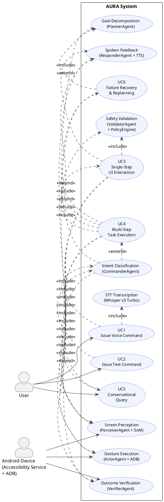

# Chapter 3: Proposed System

---

## 3.1 Problem Statement

Smartphones have become the dominant computing interface for billions of people worldwide, yet the experience of controlling them through natural language remains fundamentally broken. Despite decades of research into voice assistants, users still cannot ask their phone to perform even moderately complex tasks — composing a message, navigating to a contact profile, or adjusting a deeply buried system setting — without encountering misunderstood commands, incomplete execution, or outright refusals. The reasons for this are not superficial; they reflect deep architectural limitations that have persisted across generations of products and research prototypes alike.

The first and most pervasive problem is the rigid intent registry model. Mainstream voice assistants such as Apple Siri, Google Assistant, and Samsung Bixby all operate against a set of statically registered intents. An intent is a mapping between a pattern of natural language and a predefined system action, and these mappings must be created manually by application developers through platform-specific SDKs before any voice control of that application becomes possible. The vast majority of third-party applications on any user's device have never registered such intents. When a user says "open LinkedIn and send a connection request to Priya," the assistant returns a generic failure because no registered intent covers cross-screen navigation to a specific social action within a third-party application. This same constraint means that every time an application updates its interface, the brittle intent mapping — if it ever existed — becomes unreliable. For users with motor impairments, for drivers operating a vehicle, or for factory workers whose hands are occupied, this architectural limitation is not merely an inconvenience. It is a direct barrier to device accessibility that no amount of interface polish has resolved.

The second problem was introduced by the research community's own attempt to fix the first. Vision-language models, which can analyse an image and respond to questions about its content, opened the possibility of building agents that simply look at the screen and decide where to tap, without requiring per-app scripting or developer cooperation. Systems in this class analyse a screenshot of the current device screen and ask the model to predict the pixel coordinates of the element the user wants to interact with. The critical failure mode that emerges from this design is what this work terms coordinate hallucination. A vision-language model is a generative system: it produces outputs by sampling from a learned probability distribution over tokens, and it has no access to the device's rendering pipeline, no knowledge of the layout constraints applied by the operating system, and no geometric grounding in the actual pixel space of the display at the moment the screenshot was captured. When asked to predict a tap location, it produces numbers that sound plausible in the statistical sense of the training distribution, but those numbers may fall on empty space, on a non-interactive label, or on an entirely different element from the one the user intended. A model may predict a tap at pixel position (540, 1200) when the actual interactive button occupies a bounding box whose geometric centre lies at (540, 1180), causing the gesture to land on the background canvas below the button. This is not an edge case — it is a systematic failure that arises from the fundamental mismatch between generative coordinate prediction and the pixel-precise requirements of touch gesture execution on a physical device.

The third problem lies in the scope of what these systems attempt to do. Both rule-based voice assistants and vision-based VLM agents are predominantly designed around single commands that produce single actions. The tasks that users actually want to automate are multi-step workflows: opening Gmail, tapping Compose, filling in a recipient from the contact list, entering a subject, typing a message body, and tapping Send. Opening YouTube, searching for a specific piece of music, waiting for search results to load, selecting the correct video, and verifying that playback has actually begun. These tasks require the system to track a goal across multiple screen transitions, generate actions reactively based on what each intermediate screen shows, recognise when a step has succeeded or failed, and recover gracefully when an unexpected screen appears, such as a consent dialog, a loading spinner, or a keyboard that obscures the target element. No existing consumer product provides this capability, and the research prototypes that approach it lack the safety infrastructure necessary for deployment on a real device that has access to personal contacts, financial accounts, and authentication services.

These three categories of failure — rigid intent registries with no coverage of third-party applications, spatial hallucination in generative coordinate prediction, and the absence of multi-step execution with error recovery — together define the problem that this work addresses.

---

## 3.2 Objective of the Study

The overarching objective of this work is to design, implement, and evaluate AURA (Autonomous User-Responsive Agent), a multimodal agent system for autonomous Android navigation that resolves all three problem categories identified in Section 3.1, without requiring device modification, root access, or any cooperation from the developers of target applications. The system must operate on a physically deployed Android device across a realistic range of applications and must meet measurable performance standards under real-world conditions.

The first objective is to eliminate coordinate hallucination by architectural constraint rather than by model improvement. The system must be designed so that a vision-language model is never asked to predict pixel coordinates under any circumstances. All coordinate resolution must be derived entirely from deterministic, geometrically grounded sources: either bounding rectangles provided by the Android Accessibility Tree, which are computed by the operating system's own rendering engine from the application's actual layout pass, or bounding boxes produced by a computer vision object detector that operates directly on the raw pixel data of the screenshot. The VLM's role is restricted to semantic selection — given a set of labeled regions already drawn on the screenshot, the model must identify which region label matches the user's intent. This reformulates the task from continuous coordinate regression to discrete multiple-choice identification, which is a task that generative models perform reliably and without the spatial errors that define coordinate regression.

The second objective is to achieve universal application coverage without per-application scripting. Every Android application that renders its interface through the standard View framework exposes a structured representation of its UI through the Android Accessibility Service, regardless of whether the developer has taken any action to enable voice control. The system must exploit this infrastructure as its primary interface to every installed application, using the Accessibility Tree as the ground truth for element positions and interactability. For the minority of applications that render through Canvas, WebView, or custom graphics pipelines that bypass the accessibility framework, the system must provide a computer vision fallback that derives element locations independently from the screenshot pixels rather than from structured metadata.

The third objective is to execute multi-step tasks with reactive adaptation at every step. The system must decompose a compound natural language command into a sequence of executable sub-goals, track progress toward the overall goal across multiple screen transitions, and generate each individual action reactively based on the observed state of the device at that moment rather than from a pre-committed rigid plan. This reactive approach is essential because mobile application interfaces are inherently dynamic: popups appear unexpectedly, loading screens intervene, keyboards open and close, and navigation states change in ways that no upfront planning step can fully anticipate.

The fourth objective is to implement structured failure recovery. When an action does not produce the expected change in screen state, the system must not fail the task immediately. Instead, it must escalate through a structured sequence of increasingly aggressive recovery strategies: retrying the gesture to handle transient timing issues, re-running the perception pipeline to find an alternative element selector, scrolling to bring off-screen content into view, falling back to the computer vision detection path when the accessibility tree data may be stale, and finally, if all strategies are exhausted, marking the sub-goal as failed and continuing to the next recoverable step rather than abandoning the entire task.

The fifth objective is to enforce safety and policy guardrails throughout the entire execution pipeline. An autonomous agent with access to a real smartphone has access to personal messages, financial services, authentication credentials, and the ability to delete data or make purchases. The system must categorically block interaction with financial and payment applications, enforce action-level rate limits to prevent runaway automation, detect prompt injection attacks in user input before any language model processes them, and escalate actions with significant destructive side effects to explicit human confirmation before executing them.

The sixth objective is to meet concrete performance targets that validate the system's practical utility: end-to-end task completion exceeding 85 percent across real-world Android applications, intent classification accuracy exceeding 90 percent, and a per-step average execution latency of approximately 2.2 seconds on the evaluation hardware, measured across all application categories and command types included in the study.

---

## 3.3 Proposed Work

The proposed system, AURA, is not a single monolithic model but a coordinated ensemble of specialist components, each designed to solve one part of the problem with precision. The design is built around four principal engineering decisions that, taken together, address every failure mode identified in Section 3.1.

The first decision is the adoption of an annotation-driven perception architecture, which is the design choice that most directly solves the coordinate hallucination problem. The standard approach in vision-based UI automation presents the VLM with a raw screenshot and asks it to identify where to tap. AURA inverts this workflow entirely. Before the VLM ever receives the screenshot, the system draws numbered bounding-box overlays directly onto the image — one overlay per candidate interactive element — using coordinates sourced entirely from the Android Accessibility Tree or the YOLOv8 object detector. The VLM receives this pre-annotated image together with the user's intent description, and its only permitted output is a region identifier corresponding to one of the drawn overlays. The system then looks up the bounding box for that identifier and computes its centre point as the tap coordinate. The VLM, which performs all the semantic reasoning, never touches a coordinate number at any point in the pipeline. This Set-of-Marks (SoM) approach eliminates coordinate hallucination not by improving the model's spatial reasoning abilities, but by making spatial reasoning unnecessary for the model to perform at all.

The second decision is the decomposition of the execution pipeline into eight specialist agents, each responsible for a narrowly scoped subtask and assigned a model of appropriate size and cost. This decomposition has three concrete engineering benefits. It allows each subtask to be assigned the smallest model capable of handling it reliably, which keeps per-command inference cost low overall. It isolates failures so that when the perception pipeline encounters an unrecognisable screen, the system can retry with a different detection strategy without restarting the entire execution graph. And it creates clean, explicit interfaces between components through the shared TaskState dictionary, allowing any individual agent to be replaced, upgraded, or bypassed without modifying the others.

The third decision is to use LangGraph as the orchestration layer. LangGraph models the entire execution pipeline as a directed graph in which nodes are agent functions and edges are transition rules evaluated on the shared TaskState at runtime. The key capability this provides is conditional routing: the graph inspects the parsed intent, the confidence score, the current screen context, and the execution history at each node transition and directs the command down the shortest correct path for its type. Purely conversational commands are answered immediately without ever touching the device. System-level toggles like Wi-Fi and flashlight volume bypass the visual perception pipeline entirely. Single-step UI actions flow through a slim perception-execute-verify path. Complex multi-step tasks are routed to the Coordinator's reactive loop with full goal decomposition. This routing is not hard-coded in the graph topology; it is evaluated at runtime by edge functions that inspect the TaskState, meaning the same compiled graph handles all command categories without code duplication or branching logic scattered across the codebase.

The fourth decision is a tri-provider model routing strategy that distributes inference load across Groq, Google Gemini, and a locally-running safety classifier. Groq provides hardware-accelerated Language Processing Unit inference for the primary models. Llama 3.1 8B Instant handles intent classification and response generation at approximately 560 tokens per second, providing sub-second command parsing for the most common command types. Llama 4 Maverick 17B with 128 mixture-of-experts handles goal planning and reactive step generation, where the larger parameter count is warranted by the multi-step reasoning complexity of those tasks. Llama 4 Scout 17B with 16 experts serves as the primary vision-language model for screen annotation and region selection. Whisper Large v3 Turbo handles speech-to-text transcription for voice commands. Google Gemini 2.5 Flash is maintained as a universal fallback for every Groq-backed call, ensuring that a temporary service interruption does not cause a user-visible failure. Llama Prompt Guard 2 86M, a compact classifier specifically trained to detect prompt injection and jailbreak patterns, runs as a pre-processing step against every user input before any primary model processes it. This final component is a critical safety measure: it ensures that a malicious user cannot craft a command — whether through voice or text — that manipulates the agent into bypassing its own safety policies through engineered natural language.

---

## 3.4 Use Case Diagram

The AURA system supports five primary interaction scenarios, each activating a different path through the agent pipeline. The relationships between the user, the system boundary, and the individual use cases — including the include and extend dependencies between them — are described below in PlantUML notation, which can be rendered using any standard UML tool.

**UC1 — Issue Voice Command** is the primary interaction modality. The user speaks a command through the Android companion application. Audio is captured as raw PCM, streamed over WebSocket to the server, accumulated until an end-of-utterance boundary is detected, and passed to the STT node which invokes Whisper Large v3 Turbo on Groq. The resulting transcript is then processed identically to a typed text command by all downstream components.

**UC2 — Issue Text Command** covers the REST API and dashboard interaction path. The command arrives already as text, the STT stage is bypassed entirely, and the transcript is injected directly into the TaskState graph at the intent classification node.

**UC3 — Single-Step UI Interaction** covers commands that resolve to exactly one gesture on the current screen, such as "open YouTube," "tap the search bar," or "press Back." The perception pipeline annotates the current screen, the VLM identifies the matching region, the ActorAgent executes the gesture, and the VerifierAgent confirms the screen changed. Spoken feedback is delivered after the single execution pass.

**UC4 — Multi-Step Task Execution** covers compound commands that require navigating across multiple screens. The PlannerAgent generates a skeleton goal with two to four phases, and the Coordinator runs a perceive-decide-act-verify loop on each sub-goal reactively until the overall task is complete or the action budget is exhausted.

**UC5 — Conversational Query** covers commands that require no device interaction at all, such as asking what AURA can do, requesting the current time, or asking for a joke. The intent classifier routes these directly to the ResponderAgent, which generates a spoken response without executing any gesture.

**UC6 — Failure Recovery and Replanning** is an automatic extension of UC4 that activates whenever an executed gesture fails verification. The Coordinator escalates through the five-level retry ladder and, if the ladder is exhausted, invokes the PlannerAgent's replanning function to generate alternative sub-goals that approach the same phase objective through a different interaction path.

---

## 3.5 Architecture

The AURA system is organised as a client-server architecture in which a FastAPI backend running on Ubuntu coordinates all intelligence and issues gesture commands to a physical Android device over a persistent WebSocket connection. The server is internally structured across three logical tiers — the Input Layer, the Orchestration Layer, and the Execution Layer — that together implement the complete pipeline from raw audio or text input through to spoken feedback and physical device interaction.

**[ARCHITECTURE DIAGRAM — INSERT FIG. 1 FROM Paper.html HERE]**

### 3.5.1 Input Layer

The Input Layer is responsible for ingesting commands from the user regardless of whether they arrive as spoken audio or typed text, normalising them into a single textual representation, and injecting that representation into the processing pipeline. Voice commands are captured by the Android companion application through the device microphone. Before audio streaming begins, the application runs a lightweight on-device wake-word detector that listens continuously for the phrase "Hey AURA," preserving battery life and preventing the server from receiving ambient audio during idle periods. Once the wake word triggers, the application opens a WebSocket connection to `/api/v1/ws/audio` and streams raw PCM audio in small chunks as the user speaks. The server accumulates these chunks and applies a voice activity detection heuristic to identify the end of the utterance, at which point the complete audio buffer is forwarded to the STT node. The STT node submits the buffer to Groq's Whisper Large v3 Turbo endpoint and receives back a text transcript typically within 300 to 500 milliseconds for command-length utterances. Text commands follow a considerably simpler path: they arrive as JSON POST requests to `/api/v1/tasks`, are immediately parsed, and are injected directly into the graph at the intent classification node, bypassing the STT stage entirely. In both cases the result of the Input Layer is a text string in the `transcript` field of the shared TaskState dictionary, ready for semantic processing.

### 3.5.2 Orchestration Layer

The Orchestration Layer is the central nervous system of the AURA system. It is implemented as a fifteen-node LangGraph directed graph compiled by the `compile_aura_graph()` function at server startup. Every node is an asynchronous Python function and every edge is a conditional routing function that inspects the shared TaskState dictionary and returns the name of the next node to execute. This architecture makes all execution flow explicitly declared and observable rather than embedded in scattered conditional logic. The fifteen nodes are `stt`, `parse_intent`, `validate_intent`, `perception`, `analyze_ui`, `parallel_processing`, `create_plan`, `execute`, `speak`, `error_handler`, `decompose_goal`, `validate_outcome`, `retry_router`, `next_subgoal`, and `coordinator`. They are connected by conditional edges whose routing functions implement the four major execution paths: conversational intents route directly to `speak`; system-level device commands route to `coordinator` for direct ADB dispatch without visual perception; single-step UI actions route through `perception`, `create_plan`, `execute`, and `validate_outcome` in sequence; and multi-step compound tasks route through `decompose_goal` into the `coordinator` node which manages the full reactive loop. Partial state updates returned by each node are merged by the LangGraph framework using three custom reducer functions: `add_errors` concatenates error strings from multiple failure points across the execution trace, `update_status` applies last-writer-wins semantics for status and feedback message fields, and `update_step` is a monotonic counter that prevents the step index from regressing if a parallel branch writes a lower step number after the counter has already advanced.

**[LANGGRAPH STATE MACHINE DIAGRAM — INSERT FIG. 2 FROM Paper.html HERE]**

### 3.5.3 Execution Layer

The Execution Layer contains the eight specialist agents and all the services they depend on — `LLMService`, `VLMService`, `TTSService`, `STTService`, `GestureExecutor`, `PolicyEngine`, `PromptGuard`, and the annotation-driven `PerceptionPipeline`. These services are initialised once during the FastAPI lifespan startup event and remain resident in memory throughout the life of the server process. The OmniParser YOLOv8 model weights are preloaded into the RTX 3090 GPU during server startup in a background daemon thread, so that the first computer vision inference request does not incur the 2 to 5 second cold-start latency of loading model weights from disk into GPU memory. The Execution Layer communicates with the Android device through a persistent bidirectional WebSocket connection maintained by the Kotlin companion application. The server sends typed JSON command messages containing gesture type, pixel coordinates, text content, and timing parameters. The device streams back acknowledgements, screenshots, UI tree snapshots, and status updates. The bidirectional nature of the connection is what enables the Coordinator's reactive loop to request a fresh screen observation after each gesture without re-establishing the connection from scratch.

---

## 3.6 Modules

The eight specialist agents that form the intelligence of the AURA system each encapsulate a precisely defined responsibility. The following subsections describe the design, internal logic, and role of each agent within the broader pipeline.

### Module 1 — CommanderAgent

The CommanderAgent is the entry point for semantic processing of every user command. Its responsibility is to transform an arbitrary natural language string into a structured `IntentObject` that downstream agents can act on without further interpretation. The `IntentObject` carries five fields: `action` as the canonical action type from the registered action registry, `recipient` as the target person or application entity, `content` as the message text or search query, `parameters` as a dictionary of additional execution metadata, and `confidence` as a float between 0.0 and 1.0 that governs subsequent routing decisions.

The classification process follows a three-tier cascade ordered by computational cost. In the first tier, a rule-based classifier computes fuzzy string similarity between the input transcript and the known pattern strings for each of the over eighty registered action types. If the maximum similarity score equals or exceeds 0.85, the classifier returns immediately without invoking any language model, achieving sub-millisecond latency for common unambiguous commands such as "open YouTube," "volume up," or "go back." The threshold of 0.85 is deliberately conservative — it is architecturally preferable to incur the additional latency of an LLM call than to misclassify a command and dispatch an incorrect gesture to the device. In the second tier, when rule matching confidence falls below 0.85, Llama 3.1 8B Instant on Groq is invoked with the `INTENT_PARSING_PROMPT` template. This prompt provides the LLM with the current application context, the last executed action, any visible screen elements, and the raw transcript, and constrains the response to a JSON object with `max_tokens=300` and JSON-object response format enforcing structured output. In the third tier, the output of either classifier is passed through `_normalize_action()`, which applies a registry of alias mappings ensuring that synonymous phrasings like "launch," "start," and "open" all resolve to the canonical `open_app` action type. This tier also applies `VISUAL_PATTERNS` — regular expressions that detect references to visible screen elements such as "the blue button" or "the icon at the top" — and flags the intent as requiring visual coordinate resolution regardless of the rule classifier's confidence on the action verb alone.

Each of the eighty-plus action types in the registry is represented by an `ActionMeta` dataclass instance carrying Boolean flags used by downstream routing logic. The `needs_ui` flag indicates the action requires a current UI snapshot. The `needs_coords` flag indicates it requires a resolved pixel coordinate and must traverse the perception pipeline. The `is_dangerous` flag causes the ValidatorAgent to apply the full PolicyEngine evaluation. The `is_conversational` flag routes the command directly to the ResponderAgent. The `opens_panel` flag indicates the action opens an Android Settings panel — the architecture Android 10 and later require for system settings that would otherwise be directly togglable by malicious applications.

### Module 2 — PlannerAgent

The PlannerAgent's responsibility is goal decomposition: taking a multi-step compound command and producing a structured execution plan that the Coordinator can use to track progress, even though the specific UI interactions needed to complete each phase are generated reactively at execution time rather than by upfront planning. The PlannerAgent's `GoalDecomposer` invokes Llama 4 Maverick 17B 128e with a planning prompt describing the user's utterance, the current screen state if available, and the list of installed applications retrieved from the device's application inventory. The model returns a skeleton plan of two to four abstract `Phase` objects — brief descriptions of the logical stages of the task such as "Open the Gmail application," "Tap Compose," "Fill in the recipient and body fields," "Send the email" — without specifying the precise sequence of gestures needed for each stage.

The `_ensure_commit_coverage()` method cross-checks the generated phases against the pending commit actions implied by the user's utterance. If the user said "send" but the plan contains no phase that includes a send action, the method injects one. This prevents the failure mode in which a planning model generates a plausible-sounding plan that silently omits the side-effect-producing action that the user actually requested. During replanning following a sub-goal failure, the method enforces two additional atomicity constraints: any subgoal description exceeding twelve words is truncated because long descriptions indicate the LLM has collapsed multiple actions into a compound step, and any subgoal whose `action_type` does not appear in the `VALID_ACTIONS` registry is discarded rather than forwarded to the ActorAgent.

### Module 3 — PerceiverAgent

The PerceiverAgent is the component that most directly implements the coordinate hallucination solution, and its architecture is consequently the most carefully designed in the system. Its output is always a resolved pixel coordinate derived from one of three detection layers tried in strict priority order.

The first and primary layer uses the Android Accessibility Tree for semantic matching. When the companion application provides a structured element tree, the `_try_ui_tree()` method applies fuzzy string matching between the user's intent description and the `text` and `content_description` fields of every accessible node. Elements flagged as clickable or focusable receive higher matching priority. When a match passes the minimum confidence threshold, the method reads the element's bounding rectangle directly from the tree — as reported by the Android rendering engine — and computes its centre as the tap coordinate without invoking any model. This layer handles approximately 90 percent of all perception requests with a latency of 10 to 50 milliseconds.

The second layer activates when the accessibility tree is absent or when Layer 1 fails. This occurs primarily on screens rendered through WebView, Canvas, or custom graphics frameworks that bypass the accessibility framework. The `OmniParserDetector` runs a YOLOv8 model against a 640×640 downscaled screenshot, applies Non-Maximum Suppression at an IoU threshold of 0.5, and retains up to 50 detections per frame. The detections are used to generate a Set-of-Marks visualisation in which each region receives a unique letter badge drawn directly onto the screenshot. This annotated image, together with the user's intent description and a text summary of all detected regions, is forwarded to the VLM — Llama 4 Scout 17B 16e on Groq with Gemini 2.5 Flash as fallback — configured with `max_tokens=10`, `temperature=0.0`, and a 10-second timeout. The VLM returns only the letter identifier of the matching region. The system validates the identifier, retrieves the corresponding bounding box, and computes its centre as the tap coordinate. This layer handles approximately 7 percent of requests with a latency of 400 to 1200 milliseconds.

**[PERCEPTION PIPELINE DIAGRAM — INSERT FIG. 3 FROM Paper.html HERE]**

The third layer is a heuristic fallback that activates only when the VLM selection fails due to timeout, unparseable output, or an invalid identifier. The `HeuristicSelector` applies class-name matching and positional heuristics derived from the intent description to select the most likely element without any model inference. This layer handles fewer than 0.5 percent of requests in practice but ensures the system can always attempt an action rather than returning an unrecoverable error.

### Module 4 — ActorAgent

The ActorAgent is the system's effector: it receives a resolved action specification and translates it into a concrete gesture command dispatched to the Android device. It supports seven gesture types. A `tap` sends a single touch event at the specified coordinates. A `swipe` sends a drag from a start to an end coordinate over a specified duration. A `long_press` is implemented as a zero-distance swipe held for 800 milliseconds, which the Android input system interprets as a hold. A `double_tap` sends two rapid consecutive taps at the same coordinate with a 150-millisecond inter-event interval. A `type` action sends text input using the `input text` command with URL-encoding applied to special characters. A `key` action sends a named Android KeyEvent constant such as `KEYCODE_BACK` or `KEYCODE_ENTER`, used for navigation actions that do not require tapping a specific screen element. A `scroll` is implemented as a long swipe with duration calibrated to the desired scroll distance. All commands are serialised as JSON and sent over the persistent WebSocket connection to the companion application.

### Module 5 — VerifierAgent

The VerifierAgent determines whether each executed gesture produced the expected change in screen state. Rather than invoking a model to visually compare screenshots, the agent uses a deterministic UI signature computed from the structural content of the accessibility tree. Before each gesture, the agent records a signature — the lexicographically sorted concatenation of all visible element texts, content descriptions, and class names, hashed to a 64-bit integer. After the gesture completes and the companion application returns an updated accessibility tree, the agent computes a new signature and compares the two. A structural change indicates successful execution. For actions requiring semantic confirmation beyond structural change — such as a Send action where the presence of a "Message sent" confirmation or a "Delivered" status indicator must also be verified — a `SuccessCriteria` object attached to each sub-goal specifies the additional conditions to check. Failed verification triggers the retry routing edge rather than advancing to the next sub-goal.

### Module 6 — ValidatorAgent

The ValidatorAgent applies rule-based safety and correctness checks to every parsed intent before any gesture is dispatched. The checks proceed in a fixed priority order. First, required field presence is verified: a `send_message` action lacking a `recipient` field is rejected immediately with an explanatory message rather than being forwarded to the device. Second, the PolicyEngine is invoked with an `ActionContext` object. The engine applies five checks in sequence: a hardcoded list of permanently blocked actions covering data erasure and device root operations; a sensitive application blocklist covering financial services, payment platforms, and authentication apps matched by exact package name and keyword pattern; a list of confirmation-required actions such as delete, uninstall, and data transfer that must receive explicit user approval before execution; per-action-type rate limits evaluated against a sliding 60-second window; and a dangerous content pattern check against the action's text payload. Third, the PromptGuard classifier evaluates the user's raw transcript for prompt injection patterns. If the classifier's detection score exceeds its threshold, the command is rejected before any primary language model processes the transcript. This ordering ensures that safety checks always happen before intelligence, rather than relying on the language model to self-enforce restrictions.

### Module 7 — ResponderAgent

The ResponderAgent generates the spoken feedback that closes every interaction loop. Its first action is to check whether the completed action falls into the category of Android Settings panel openings. Twenty-one such actions exist — covering Wi-Fi, Bluetooth, mobile data, NFC, airplane mode, battery saver, and related settings — and for all of them, the Android 10 security model prevents direct system toggling from third-party applications, requiring the system to open the relevant panel and ask the user to complete the toggle manually. For these twenty-one cases, predefined responses are returned from the `PANEL_ACTION_RESPONSES` dictionary without any LLM call, since the response format is always the same. For all other actions, the agent performs emotion detection on the user's original transcript using `EMOTIONAL_PATTERNS`, which identifies signals of frustration, gratitude, excitement, confusion, and sadness. The detected emotion is incorporated into the LLM prompt context, calibrating the response tone accordingly. The `AURA_PERSONALITY` system prompt establishes the agent's conversational identity as helpful, concise, and action-oriented. For task completions, `temperature=0.1` and `max_tokens=80` produce brief factual confirmations. For conversational responses, the temperature is raised to 0.7 and a larger token budget enables more engaging dialogue. The generated text is cleaned of LLM artifacts and forwarded to the TTS service, which synthesises audio using Edge-TTS `en-US-AriaNeural` and delivers it over WebSocket to the companion application for playback.

### Module 8 — Coordinator

The Coordinator is the most architecturally complex component of the system. Its responsibility is to manage the complete perceive-decide-act-verify loop for multi-step tasks, interleaving goal planning, screen observation, reactive action generation, gesture execution, outcome verification, and failure recovery across an unbounded number of screen transitions until the goal is achieved or the execution budget is exhausted.

At the start of a multi-step task, the Coordinator calls the PlannerAgent to produce a skeleton `Goal` object with two to four abstract phases and a list of pending commit actions. The Coordinator then enters its main execution loop, bounded by a maximum of 30 total actions per goal and a maximum of 3 replanning invocations. At each iteration, when no pending sub-goal exists, the Coordinator captures a fresh screenshot and UI tree, constructs a Set-of-Marks annotated image, and passes this visual context to the `ReactiveStepGenerator`. The generator invokes the VLM with a structured prompt that includes the goal description, the current skeleton phase, the full step history so far, and the annotated screenshot. The model returns a single concrete next action as a JSON object carrying fields including `action_type`, `target`, `description`, `phase_complete`, `goal_complete`, `prev_step_ok`, `prev_step_issue`, and `thinking`. The `thinking` field, containing the model's reasoning chain, is logged for debugging but not shown to the user. The `prev_step_ok` and `prev_step_issue` fields represent an integrated verification pass: the VLM, seeing the current screen state, assesses whether the previous action actually achieved its intended effect. This catches semantic failures — such as a previous tap opening a wrong submenu — that the VerifierAgent's signature-based check might miss if the screen changed but changed incorrectly.

**[REACT REASONING LOOP DIAGRAM — INSERT FIG. 4 FROM Paper.html HERE]**

The generated action is validated by the ValidatorAgent, executed by the ActorAgent, and then assessed by the VerifierAgent through UI signature comparison. If the sub-goal succeeds, the Coordinator records it as a `StepMemory` entry and advances to the next sub-goal or phase. If it fails, the Coordinator escalates through the five-level retry ladder in order: retrying the identical gesture to handle transient timing issues, re-running perception to find an alternative element selector, executing a scroll gesture to expose off-screen content before retrying, forcing the OmniParser computer vision path even when a UI tree is available to work around stale accessibility data, and finally marking the sub-goal as failed and either continuing to the next sub-goal or invoking replanning if critical commit actions remain unexecuted. Goal completion is additionally detected heuristically without requiring a VLM call: a visible Pause button confirms media playback, active navigation controls with an End option confirm route execution, and the presence of "Sent" or "Delivered" text confirms message delivery.

---

## 3.7 Prototype Developed

The AURA prototype was built as a fully integrated end-to-end system and deployed on physical hardware for evaluation. The prototype consists of three primary components: the FastAPI server backend running on Ubuntu, the Kotlin companion application running on a physical Android device, and a static HTML monitoring dashboard served by the backend and accessible through any standard web browser on the local network.

### Hardware and Operating Environment

The server runs on Ubuntu 22.04 LTS on an AMD Ryzen 9 5950X processor with 16 cores clocked at a base of 3.4 GHz, supported by 64 GB of DDR4 system memory and an NVIDIA GeForce RTX 3090 with 24 GB of VRAM. The RTX 3090 is used for local OmniParser YOLOv8 inference and Prompt Guard classification; all primary LLM and VLM inference is handled by Groq's cloud Language Processing Units over the network. Storage is provided by an NVMe solid-state drive with sustained read speeds exceeding 3000 MB/s, keeping model weight loading latency at server startup to approximately one to two seconds. The backend application runs Python 3.11 and is launched via Uvicorn with ASGI support, bound to all interfaces on port 8000. The middleware stack includes CORS middleware configured to allow connections from any origin to support the Android companion application and the browser dashboard, TrustedHost validation, request ID injection via the `X-Request-ID` header, and rate limiting middleware that prevents request flooding from misbehaving clients.

The Android test device is a OnePlus CPH2661 running Android 16 API Level 36 with a 6.7-inch 1080×2412 pixel display. The device communicates with the server over a local area network connection, with ADB enabled over TCP for gesture injection. Android 16's Accessibility Service framework provides the UI element tree for each screen with full bounding rectangle precision as reported by the platform rendering engine.

### Software Stack and System Integration

The backend is built on FastAPI and organised into eleven API router modules — `health`, `graph`, `tasks`, `device`, `config_api`, `workflow`, `websocket`, `device_router`, `task_router`, `websocket_router`, and optional development-mode debug and test routers — all registered under the `/api/v1` prefix. LangGraph and LangChain provide the orchestration substrate. OpenCV handles screenshot preprocessing, bounding box drawing, and Set-of-Marks overlay generation. Ultralytics YOLOv8 provides the object detection inference engine used by the OmniParser fallback path. Microsoft Edge-TTS handles speech synthesis, and the standard Python `websockets` library manages the bidirectional JSON protocol with the Android companion application.

The Android companion application is written in Kotlin and registers a persistent Accessibility Service that runs in the background regardless of which application is in the foreground. The service uses the `getWindows()` API to capture the full accessibility tree on demand and serialises each node's bounds, text, content description, class name, and interactability flags into JSON documents sent to the server. Screenshot capture is handled through the Android `MediaProjection` API, which captures a full-resolution pixel buffer of the current display. Gesture injection uses the Android `GestureController` API via `dispatchGesture()` for swipes, long presses, and coordinate-specified actions, and `AccessibilityNodeInfo.ACTION_CLICK` for node-targeted taps.

### Applications Evaluated

The prototype was evaluated against real-world commands across six application categories on the physical device. Gmail testing covered composing new emails, searching for messages by sender or keyword, reading message bodies aloud, and replying to threads. LinkedIn testing covered profile search by name, sending connection requests, composing and sending direct messages, and interacting with posts in the feed. Chrome testing covered typing URLs, executing web searches, scrolling through results, and opening links in new tabs. Android Settings testing covered navigating to Wi-Fi, Bluetooth, and display brightness settings, and enabling Do Not Disturb mode. Home screen and App Drawer testing covered launching applications by voice name, interacting with home screen widgets, and scrolling through the application list. YouTube testing covered search query entry, selecting a video from search results, verifying playback onset, and using the player controls.

### Performance Outcomes

The system achieved end-to-end task completion exceeding 85 percent across all tested application categories and a 90 percent intent classification accuracy on the evaluation command set. The per-step average latency measured approximately 2.2 seconds across all execution paths. The UI Tree perception layer contributed 10 to 50 milliseconds per step. OmniParser plus VLM contributed 400 to 1200 milliseconds on the approximately 7 percent of steps that required it. STT transcription contributed 300 to 500 milliseconds for voice commands. TTS synthesis contributed approximately 200 milliseconds per response. Prompt Guard classification contributed under 50 milliseconds as a fixed overhead on every command. The compiled LangGraph state machine contains exactly fifteen nodes connected by twelve conditional edges and three unconditional edges, and the same compiled graph instance handles all four command categories — conversational, system-level, single-step UI, and multi-step goal — without code duplication.

---

*End of Chapter 3: Proposed System*
